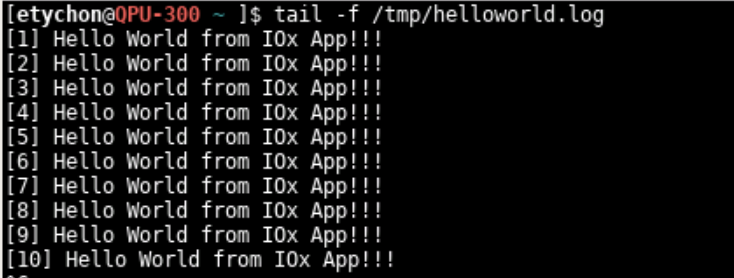
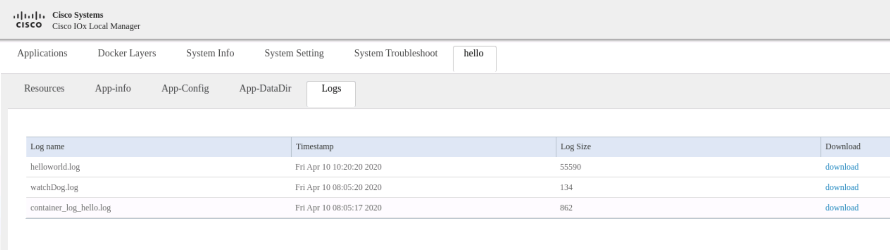

# iox-x86-hello-world

This is an IOx application that is meant to be executed on x86-based Cisco platforms such as IR809, IR829 and IC3000.

## Use Case Description

The purpose of this example is to demonstrate how to build a small but complete Docker image that will execute on x86 based platforms. The core of this example is a classic Hello World example, logging output to a log file accessible through Cisco IOx Local Manager.

This has been tested on IR8x9 and IC3000.

If you do not want to build your own package, a pre-built, ready-to-use IOx application can be [directly downloaded from the Releases](https://github.com/etychon/iox-x86-hello-world/releases). It can also be used as a sample application for IOx.

## Package Components

#### Prerequisites

The base files needed to build and package the IOx application are the following:

* helloworld.c
* start.sh
* Dockerfile
* package.yaml


In addition, make sure to have:

* A Linux machine to run the build process. We use [CentOS 8](https://www.centos.org/) but any other Linux distribution will do.
* a running version of [Docker](https://www.docker.com/)
* Cisco [ioxclient](https://developer.cisco.com/docs/iox/#!iox-resource-downloads) installed

#### helloworld.c

The core is a `helloworld` program written in C, that will essentially write in a log file. In IOx any file in the directory defined by the environment variable `${CAF_APP_LOG_DIR}` will be visible in Local Manager. It is therefore very interesting from a maintenance and debug point of view to log everything in that location.

Environment variables in C can be accessed with `getenv()` such as:

    char* log_dir = getenv("CAF_APP_LOG_DIR");

The beauty is that you do not even need to have a compiler installed because `helloword` will be built inside a build container during the build process.

#### start.sh

We call `start.sh` a wrapper, it is not always needed but in this case the wrapper will make sure there is an environment variable `${CAF_APP_LOG_DIR}` set before launching `helloworld`.

Some Cisco platforms that are not running Docker engine will actually run the Docker image as an LXC container. In this case the environment variables are not loaded automatically. The wrapper will take care of that by loading environment variables in `/data/.env` with:

```
CAF_SS_ENV_FILE="/data/.env"
if [ -f $CAF_SS_ENV_FILE ]; then
  source $CAF_SS_ENV_FILE
fi
```

If there is no `/data/.env` this may mean two things: either this is a Docker native platform, or this is not running in IOx - for example on your own computer. It is always advisable to test locally when possible before testing on IOx, so we will make those two cases work.

If this is an IOx Docker-native platform, there is no `/data/.env` but the environment variables `${CAF_APP_LOG_DIR}` is passed in the Docker container. In this case the environment variable is already set and no action is needed.

If this runs on your computer, there is no `/data/.env` and the environment variable `${CAF_APP_LOG_DIR}` is not set. In this case we will set it ourselves to `/tmp` like so:

```
if [[ -z ${CAF_APP_LOG_DIR} ]]; then
  export CAF_APP_LOG_DIR="/tmp"
fi
```

We can then run the `helloworld` program confidently knowing that our log file is going to be written at the right place.

#### Dockerfile

`Dockerfile` is a special file that tells Docker how to build an image. Our file will be a two-stage build:

  - First create a Docker image internally called `builder` with a C-compiler (gcc) and build `helloworld` from source. The gcc program is part of the package installed with `opkg install iox-toolchain`.

  Out of the image we will only keep the `helloword` program, therefore the final image will not have GCC as this will not be needed. It is imperative to keep your running containers small and tidy to reduce the size, dependencies, complexity, and to reduce the attack surface.

  ```
  FROM devhub-docker.cisco.com/iox-docker/ir800/base-rootfs as builder
  RUN opkg update
  RUN opkg install iox-toolchain
  RUN mkdir -p /var/helloworld/
  COPY helloworld.c /var/helloworld/
  WORKDIR /var/helloworld/
  RUN gcc helloworld.c -o helloworld
  ```

  - Secondly the final image is built based on a compact, Cisco-supplied rootfs. The `helloword` program is copied from the first stage (`--from=builder`) to the second stage.

  `helloworld` is then made executable and lastly we run the `start.sh` script made previously that is the wrapper to start `helloworld`.

  ```
  FROM devhub-docker.cisco.com/iox-docker/ir800/base-rootfs
  RUN mkdir -p /var/helloworld/
  COPY --from=builder /var/helloworld/helloworld /var/helloworld
  COPY start.sh /
  RUN chmod +x /var/helloworld/helloworld
  CMD ["/bin/sh", "/start.sh"]
  ```

We now have everything in place to build the Docker image with:

    docker build -t iox-x86-hello-world .

You can check is this runs on your computer with:

    docker run iox-x86-hello-world

While this runs, the /tmp/helloworld.log should fill up like this:



All right - now we know that our Docker image `iox-x86-hello-world` works, but that's not yet an IOx application.  

#### package.yaml

You can skip the creation of the `package.yaml` and directly jump to the next section because in this case our application does not need anything special. In practice you may want to give it a specific name, of version number, open ports, etc... so let's review what in a simple `package.yaml` file.

The `info` section is what is going to be visible after the application is deployed, such as name, version and description. This is purely administrative.

```
info:
  name: iox-x86-secure-storage-demo
  description: "Small Linux with CURL to test IOx Secure Storage"
  version: "1.0"
  author-link: "http://www.cisco.com"
  author-name: "Cisco Systems"
```

The `app` section defines the type of IOx application (Docker in this case, but this can also be LXC, PaaS or VM), the CPU architecture, the resources needed by the application (CPU, memory, disk), and the network interface(s).

Should you need to expose specific UDP or TCP ports, this is where this will also be defined.

```
app:
  type: docker
  cpuarch: x86_64
  resources:
    profile: custom
    cpu: 100
    memory: 32
    disk: 10

    network:
      -
        interface-name: eth0
```

The last piece needed is to tell what application to run when the container starts. Not that in IOx this overrides what is in the Dockerfile.

Also note then when the program exits, the container stop running. Therefore ideally this program should run forever. If a target command such as 'sleep' is being used, the container stop when 'sleep' terminates. This may or may not be needed but generally speaking you want your container to keep running.

The wrapper script can also be used to restart a crashed application. While it is not a substitute for writing applications that do not crash, it may help to keep the service running despite those crashes.

```
startup:
  rootfs: rootfs.tar
  target: ['/bin/sh', '/start.sh']    
```

You can find a comprehensive list of all possible options on [Cisco DevNet - IOx Package Descriptor](https://developer.cisco.com/docs/iox/#!package-descriptor/iox-package-descriptor) documentation.

#### Build the IOx application

Now that we have everything in place we can build the IOx application using the `ioxclient` utility. Simply do:

    ioxclient docker package iox-x86-hello-world . \
        -n iox-x86-hello-world --use-targz

And you should have a file `iox-x86-hello-world.tar.gz` in your current directory which is your IOx application.

#### Installation

Cisco IOx Local Manager can be used to deploy the application on your gateway.

Because accessing Local Manager can be sightly different depending how your gateway is configured, the type of gateway, of the software release, please refer to the [Cisco IOx Local Manager Reference Guide, Release 1.9](https://www.cisco.com/c/en/us/td/docs/routers/access/800/software/guides/iox/lm/reference-guide/1-9/b_iox_lm_ref_guide_1_9/b_iox_lm_ref_guide_1_9_chapter_010.html) for details on how to perform this task.

In essence you will need to:

* Log in to Cisco IOx Local Manager
* Deploy the application `iox-x86-hello-world.tar.gz`
* Activate the application
* Start the application

#### Logging

When the application is running, go to your application's "Log" tab and see the `helloworld.log` file. It is the proof that you container is running.



If the code is configurable, describe it in detail, either here or in other documentation that you reference.

### DevNet Sandbox

Should you wish to be guided though those steps without having your own Cisco IOx gateway, you can use one of Cisco DevNet Sandbox. We have a [selection of labs for you to learn how to use Cisco IOx](https://developer.cisco.com/learning/modules/IoT-IOx-Apps).
